# My Budget Buddy
## Introduction

### Live Website

## Table of Contents

## User Experience

### Who My Budget Buddy Caters For

### User Stories
| User Want or Need | How It Is Achieved | Achieved |
| :---------------: | :----------------: | :------: |
| User Want or Need | How It Is Achieved | Achieved |
| User Want or Need | How It Is Achieved | Achieved |

## Site Overview

## Planning

### Figma Wireframes

#### Landing Page
- On Mobiles:

    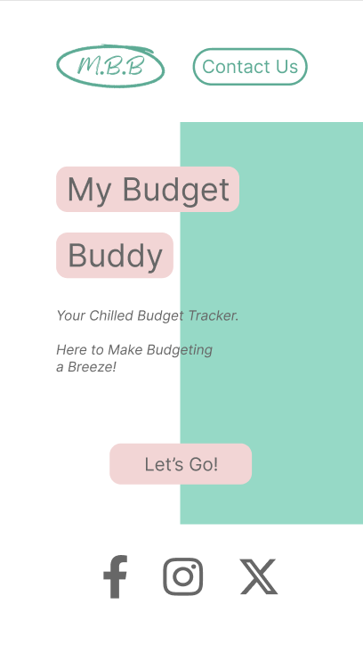

- On Larger Devices:

    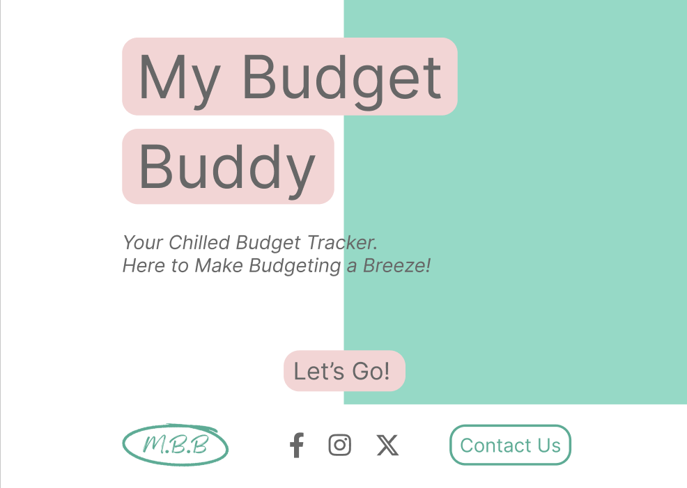
#### Income & Budget Modal
- On Mobiles:

    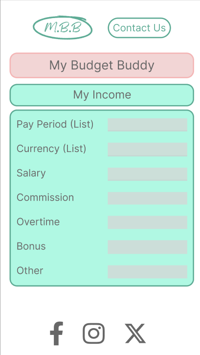  

    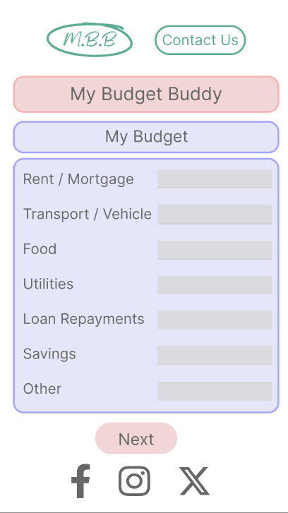 
- On Larger Devices:
  
    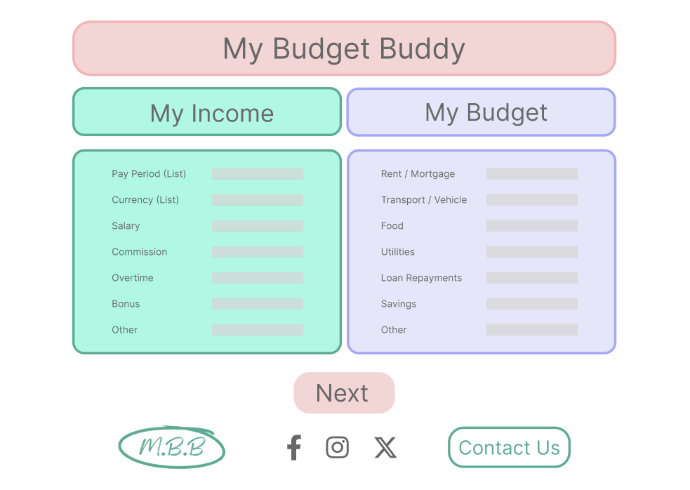

#### Spends Modal
- On Mobiles:

    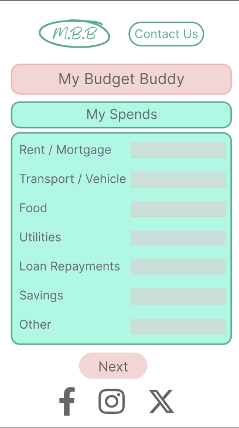
- On Larger Devices:

    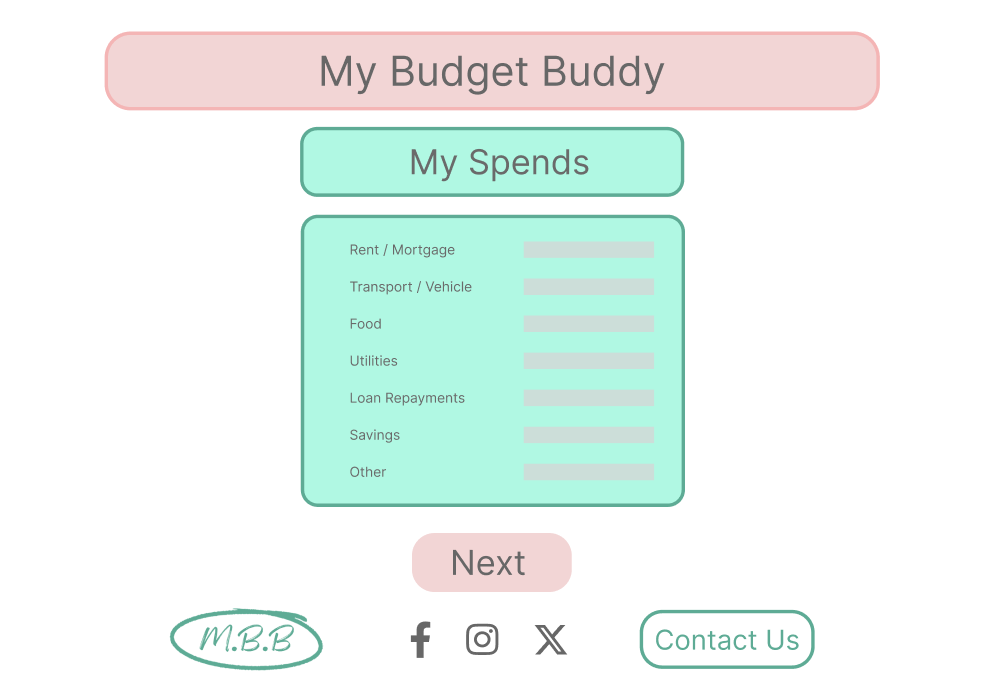
#### Results Modal
- On Mobiles:

    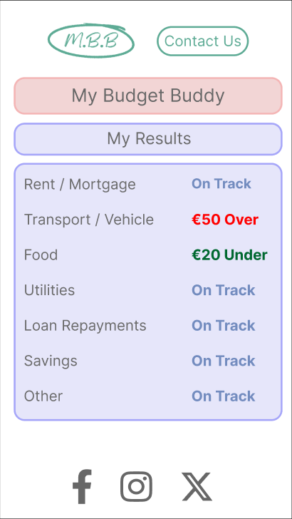

    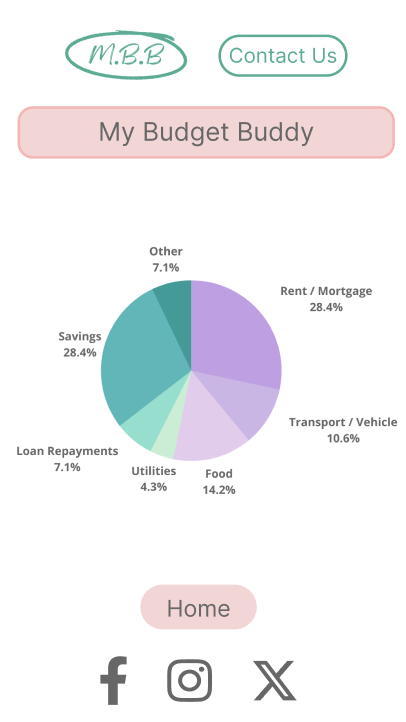
- On Larger Devices:

    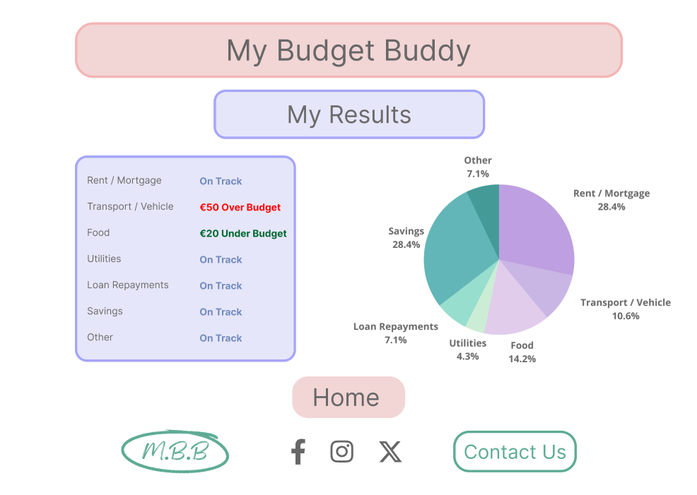
#### Contact Form
- On Mobiles:

    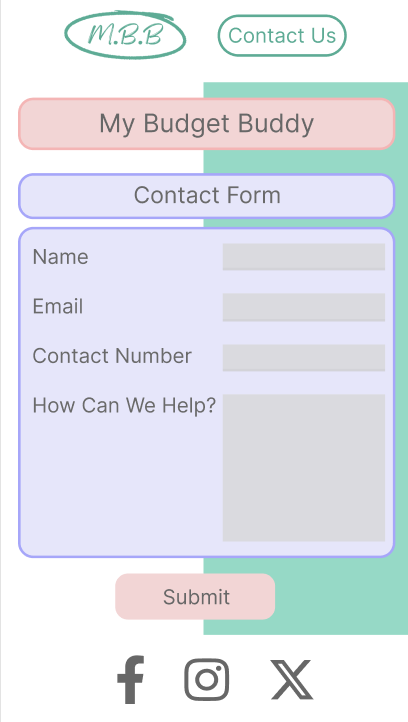
- On Larger Devices:

    
#### Thank You Page
- On Mobiles:

    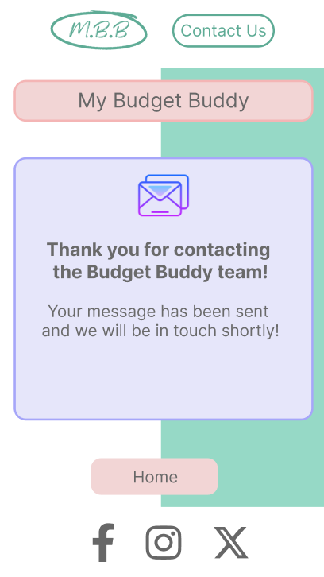
- On Larger Devices:

    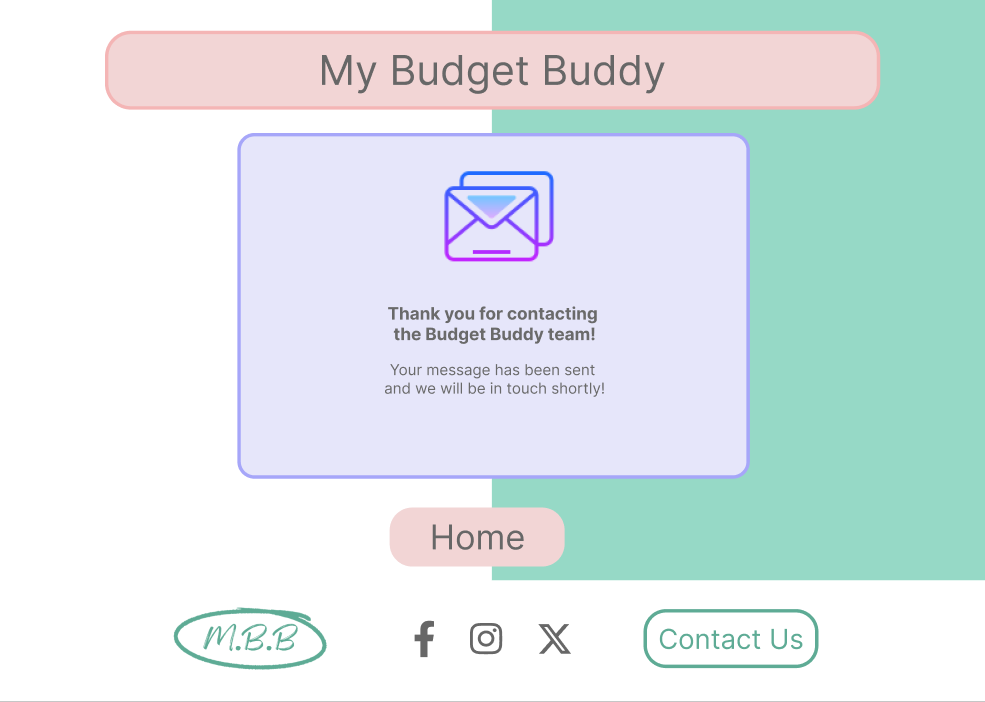
#### 404 Page
- On Mobiles:

    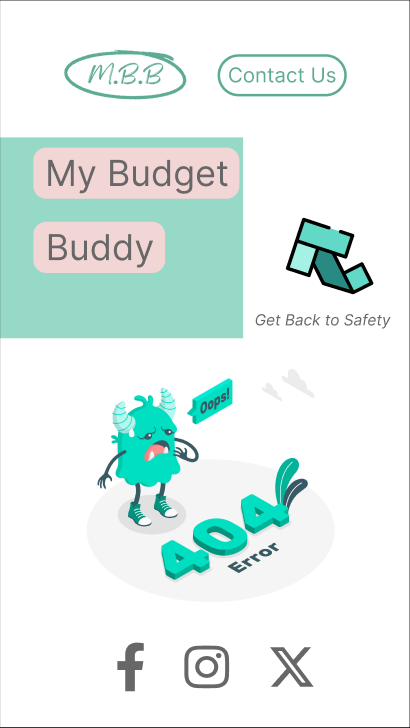
- On Larger Devices:

    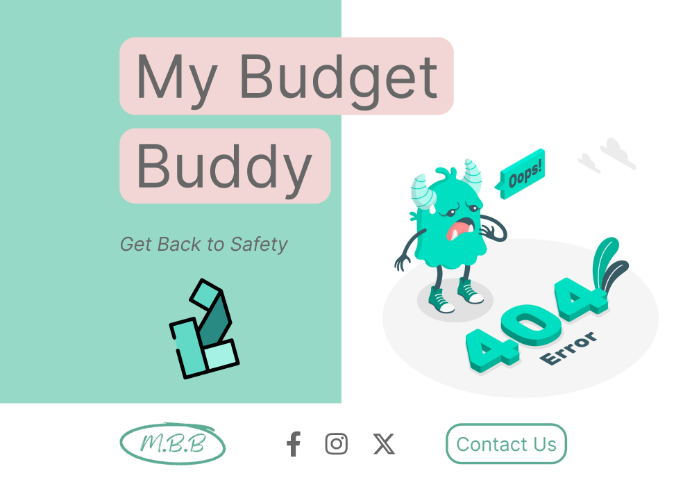
### Color Scheme

## Features

### Existing Features

#### Navigation Bar / Header
- On mobiles the navigation bar consists of the My Budget Buddy logo and Contact Us button. The logo takes the user to the home page and the Contact Us button takes the user to the contact form.
- On larger devices, the layout changes to shift the header information to the footer to make the main content stand out more.

#### Landing Page
- The landing page offers a minimalistic layout including the header, cover text title, short description, "Let's Go" button and the footer.
- The user is presented with instant feedback as to what the My Budget Buddy website is for, whilst keeping the layout minimal, giving a feel of ease.
- By clicking the "Let's Go" button, the user is presented with the first section of the My Budget Buddy modal.

#### Footer
- On mobiles the footer contains the social media links which open in separate tabs and include aria labels for accessibility.
- On larger devices the footer includes the social media links as well as the logo and Contact Us button to put the main content as the focus. The logo takes the user to the home page and the Contact Us button takes the user to the contact form.

#### Income & Budget Modal
- On mobiles the user is presented with the my income modal where they select their pay period and currency from dropdowns and fill in their income. By scrolling down, the user is then presented with the budget modal where they fill in their budget for different categories.
- On larger devices, the layout is changed to present the user with the income modal and budget modal next to each other.
- After the user has selected the pay period, the selection will appear in the heading as confirmation.
- After the user has selected the currency, the currency will appear next to the input fields as confirmation.
- When the "Next" button is clicked, a calculation is done to check if the budget is less than or equal to the income. If it is, the user is taken to the next modal. If the budget is more than the income, the user is presented with an alert to re-visit their budget.

#### Spends Modal
- The spends modal has the same information as the budget modal and once the "Next" button is clicked, the user is taken to the results modal.

#### Results Modal
- On mobiles the user is first provided with a breakdown of their results per category. After scrolling, the user is also provided with a pie chart as an overall result.
- On larger devices, the user is provided with the breakdown as well as the pie chart next to each other.
- The individual categories take the budget and spends values to calculate if the user is over budget, under budget or on track:
  - Over budget values are presented in red.
  - Under budget values are presented in green.
  - On track values are presented in lavendar.
- A "Home" button is provided at the end of the modal as confirmation to the user that the budget is complete.

#### Contact Form
- The contact form layout is the same on mobiles as well as desktops.
- The user fills in their name, email, contact number and query. Each input field checks to confirm that the correct type of information has been inputted.
- A "Submit" button is visible at the bottom of the contact form and when clicked, the user is taken to the "Thank you Page".

#### Thank You Page
- The "Thank You Page" maintains the same minimal layout as the rest of the website.
- This provides the user with confirmation that their query has been submitted and one of the team will be in touch.
- A "Home" button is visible after the message which takes the user to the home page.

#### 404 Page
- A 404 page has been designed should a part of the website not load.
- This lets the user know that something has not gone to plan and directs them to the home page with an arrow.

#### Favicon
- A minimal favicon has been utilized to correspond with the website layout.
- This provides ease of use to the user to find the website among any other tabs they may have open.

### Future Features to Implement

## Testing

| Test | Action | Expectation | Result |
| :---: | :---: | :---: | :---: |
| Test | Action | Expectation | Result |
| Test | Action | Expectation | Result |

### Lighthouse

### Validator Testing
- HTML
- CSS
- JavaScript

### WAVE

### Bugs

#### Fixed Bugs

#### Unfixed Bugs

## Deployment

## Credits

### Content
- Wireframes designed using [Figma](https://www.figma.com/)

### Media

### Color Scheme, Fonts & Icons
- Social media icons sourced from [Font Awesome](https://fontawesome.com/)
- Email icon sourced from [Icons8](https://icons8.com/)

### Extensions

### Other
