# My Budget Buddy
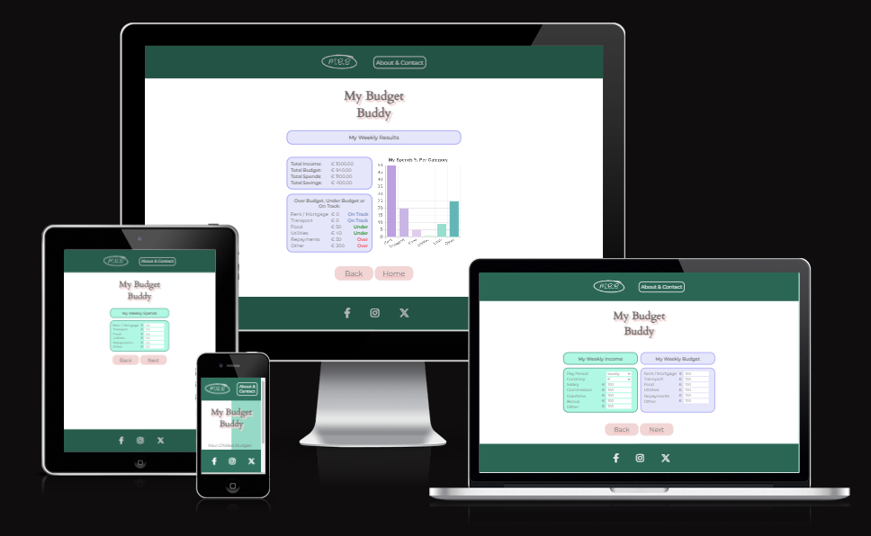
## Introduction
Welcome to My Budget Buddy, a website designed to make budgeting a breeze. Our website is here to make the user feel right at home with calming colors, a minimal layout and easy to follow steps.
### Live Website
The live My Budget Buddy website can be found [here](https://taalverena.github.io/my-budget-buddy/).
## Table of Contents

## User Experience

### Who My Budget Buddy Caters For

### User Stories
| User Want or Need | How It Is Achieved | Achieved |
| :---------------: | :----------------: | :------: |
| Easily see what the website is for and how to use it | An About & Contact page has been set up with information about the website and steps on how to use the website | Yes |
| Navigate the website with ease | Buttons are set up throughout the page (in the header, footer and throughout the different sections) | Yes |
| Easily input income, budget & expenses | Modals created with clearly labelled inputs for different categories | Yes |
| Quick access to my results | Results shown once the 3 sections are filled in | Yes |
| Results breakdown | Results broken down into total, per category and shown in a bar graph | Yes |
| Get in contact with the My Budget Buddy team | A contact form has been provided along with a thank you page as confirmation after the form is submitted | Yes |


## Site Overview
My Budget Buddy is a user-friendly platform for managing and analyzing your financial budget. With our site, easily input your income, planned budget, and expenditures to gain valuable insights into your financial health. This documentation provides a comprehensive overview of the website and its functionalities.

## Planning

### Figma Wireframes

#### Landing Page
- On Mobiles:

    

- On Larger Devices:

    
#### Income & Budget Modal
- On Mobiles:

      

     
- On Larger Devices:
  
    

#### Spends Modal
- On Mobiles:

    
- On Larger Devices:

    
#### Results Modal
- On Mobiles:

    

    
- On Larger Devices:

    
#### Contact Form
- On Mobiles:

    
- On Larger Devices:

    
#### Thank You Page
- On Mobiles:

    
- On Larger Devices:

    
#### 404 Page
- On Mobiles:

    
- On Larger Devices:

    
### Color Scheme

## Features

### Existing Features

#### Navigation Bar / Header
- On mobiles the navigation bar consists of the logo and About & Contact button. The logo takes the user to the home page and the About & Contact button takes the user to the contact form.
  
    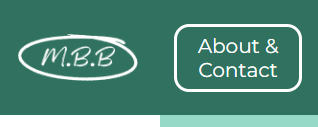
- On larger devices, the layout changes expand the About & Contact link to balance out the header.
    

#### Landing Page
- The landing page offers a minimalistic layout including the header, cover text title, short description, "Let's Go" button and the footer.
- The user is presented with instant feedback as to what the My Budget Buddy website is for, whilst keeping the layout minimal, giving a feel of ease.
- By clicking the "Let's Go" button, the user is presented with the first section of the income and budget modal.
- The layout is the same on mobiles and larger devices, with the content adjusting slightly to cater for the device in use.

    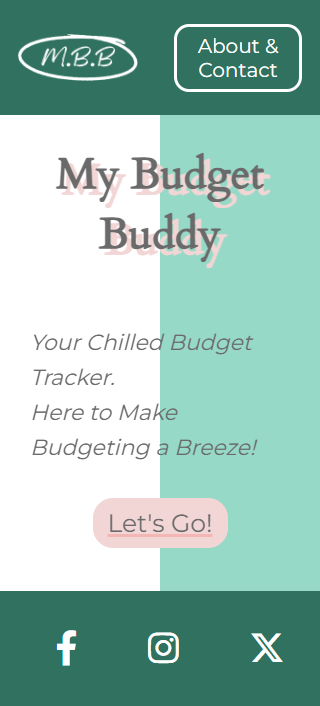

    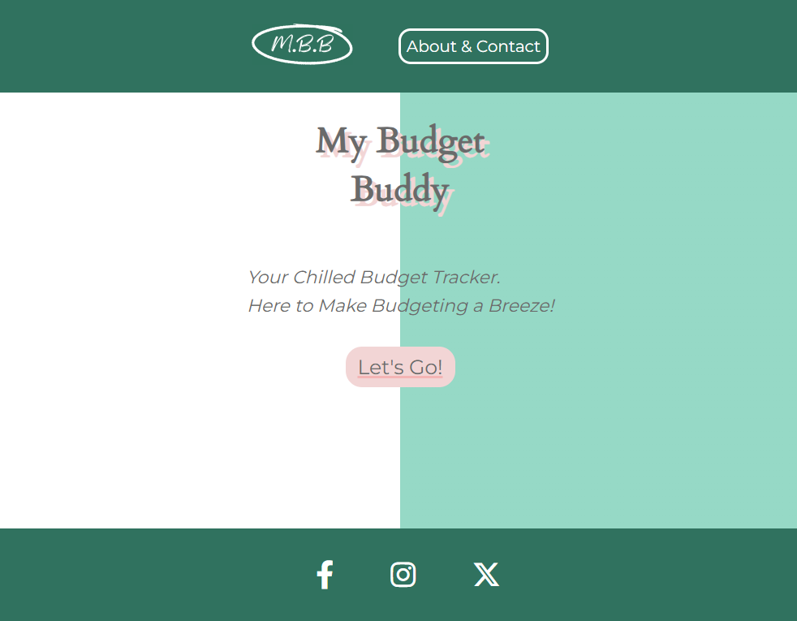

#### Footer
- The footer contains the social media links which open in separate tabs and include aria labels for accessibility.

    

    

#### Income & Budget Modal
- On mobiles the user is presented with the income modal where they select their pay period and currency from dropdowns and fill in their income. By scrolling down, the user is then presented with the budget modal where they fill in their budget for different categories.

    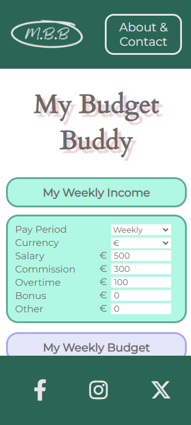
    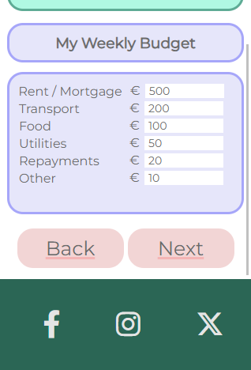

- On larger devices, the layout is changed to present the user with the income modal and budget modal side by side to make use of the larger page width.

    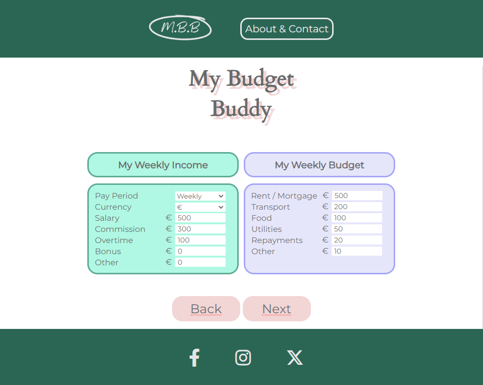

- After the user has selected the pay period, the selection will appear in the heading throughout all modals as confirmation.
- After the user has selected the currency, the currency will appear next to the input fields throughout all modals as confirmation.
- When the "Next" button is clicked, a calculation is done to check if the budget is less than or equal to the income. If it is, the user is taken to the next modal. If the budget is more than the income, the user is presented with an alert to re-visit their budget.
- If the user clicks the "Back" button, they are taken back to the home page.

#### Spends Modal
- The spends modal has the same information as the budget modal for ease of use and once the "Next" button is clicked, the user is taken to the results modal.
- If the user clicks the "Back" button, they are taken back to the income and budget modal.

    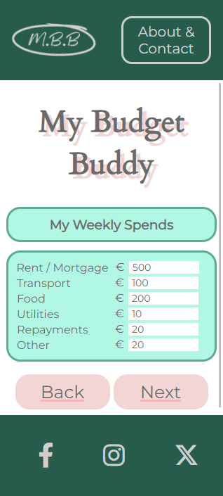
    
    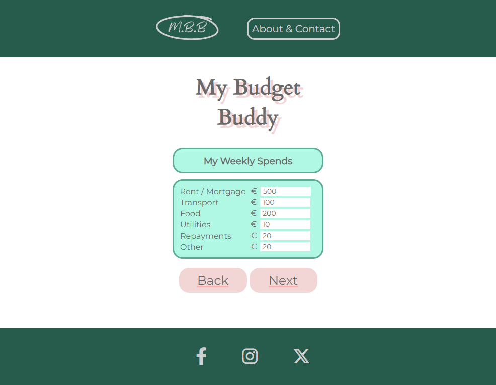

#### Results Modal
- On mobiles the user is first provided with a breakdown of their total income, budget, expenses and savings. 

    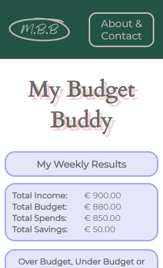

- After scrolling, the user is provided with a breakdown per category (over budget, under budget or on track) along with a bar graph showing their expenses as a percentage of their income.

    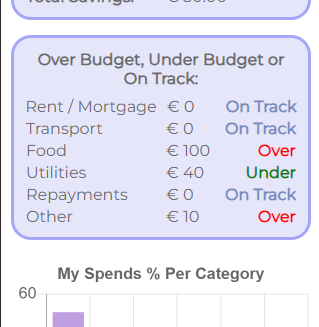
    
    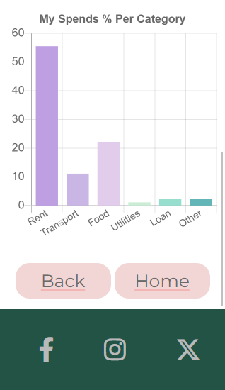
- On larger devices, the user is provided with the breakdown of their totals along with each category on the left and the graph on the right.

    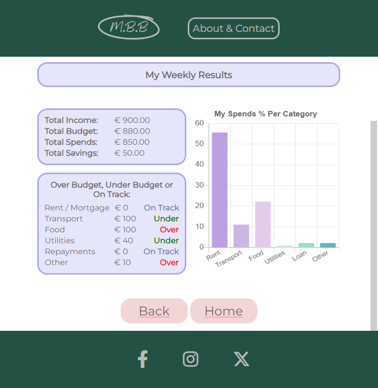

- The individual categories take the budget and spends values to calculate if the user is over budget, under budget or on track:
  - Over budget values are presented in red.
  - Under budget values are presented in green.
  - On track values are presented in lavendar.
- The graph shows the user their expenses as a percentage of their income. The graph is presented in a bar graph to make it easy to read and understand.
- A "Home" button is provided at the end of the modal as confirmation to the user that the budget is complete. When clicked, the user is taken to the home page.

#### About & Contact Page
- The About & Contact Page consists of an About Us section, How It Works section and Contact Us form.
- The layout is the same on mobiles and desktops with margin and padding adjusted depending on the device size.
##### About Us
- This section gives the user information about what My Budget Buddy is for and confirms that it manages income, expense and budget goals.

    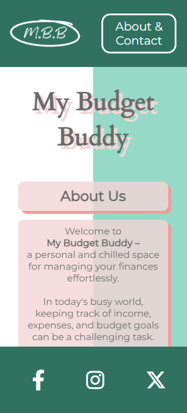

    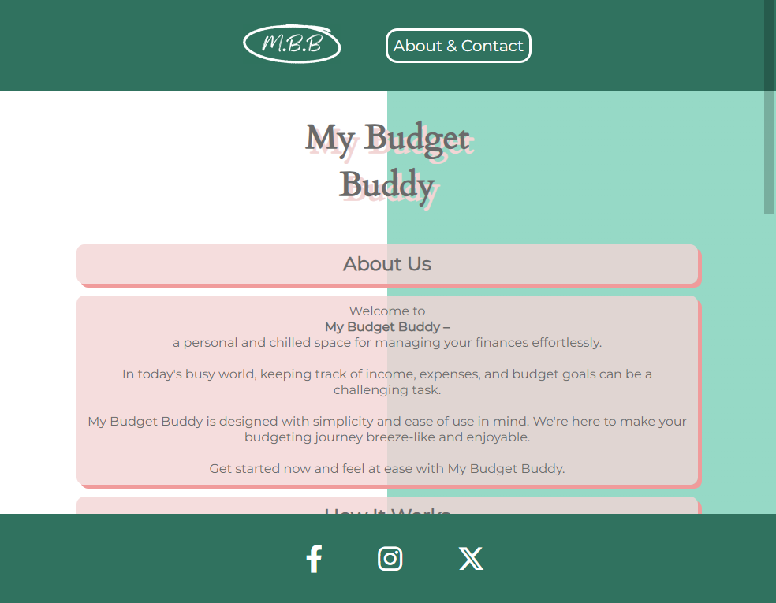
##### How It Works
- This section explains how the website works, how to navigate each modal and what My Budget Buddy can do for the user.

    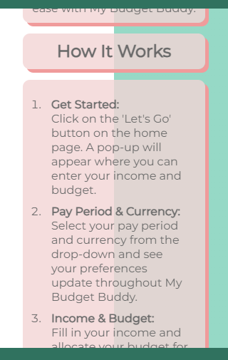

    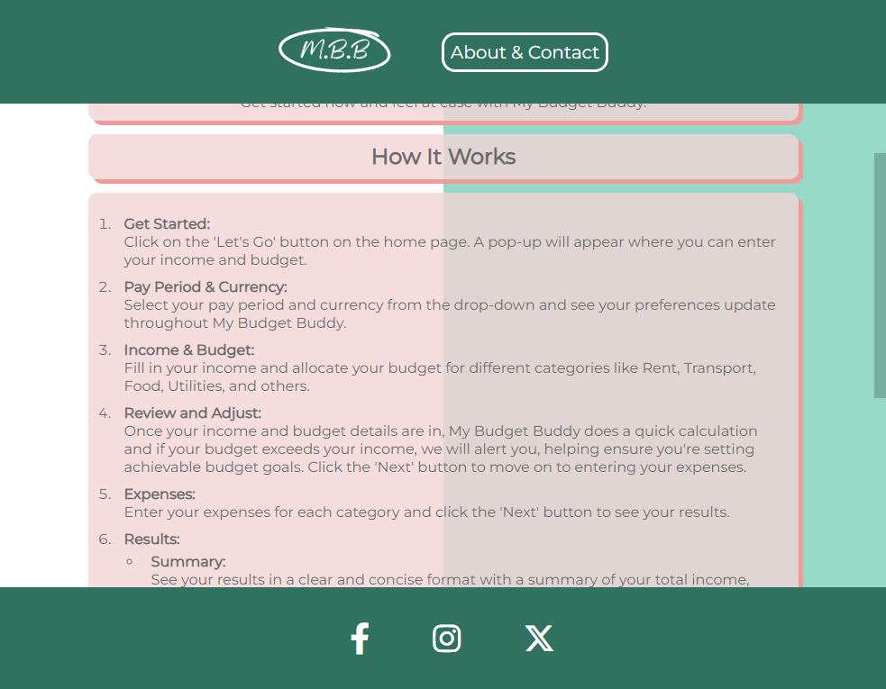
##### Contact Us
- This section enables to user to contact the My Budget Buddy team through the use of a quick, minimal contact form.
- The user fills in their name, email, contact number and query. Each input field checks to confirm that the correct type of information has been inputted.
- A "Submit" button is visible at the bottom of the contact form and when clicked, the user is taken to the "Thank you Page".

    
    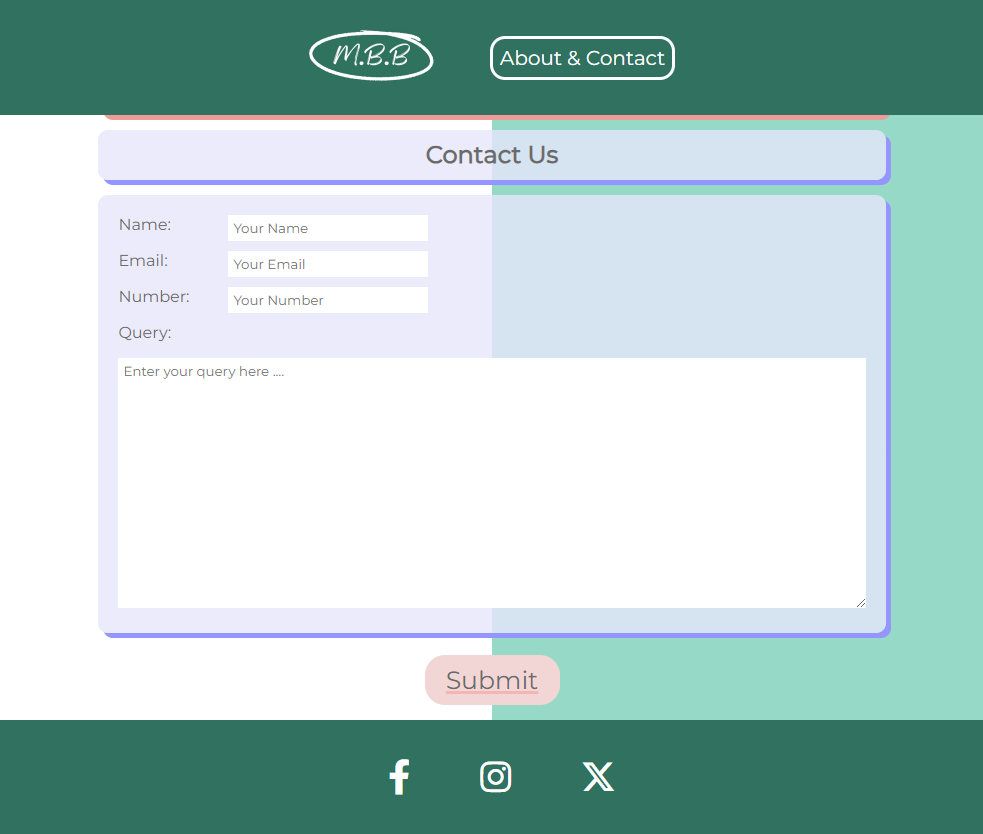

#### Thank You Page
- The "Thank You Page" maintains the same minimal layout as the rest of the website.
- This provides the user with confirmation that their query has been submitted and one of the team will be in touch.
- A "Home" button is visible after the message which takes the user to the home page.
    
    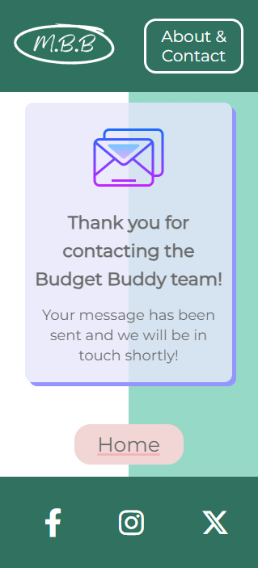
    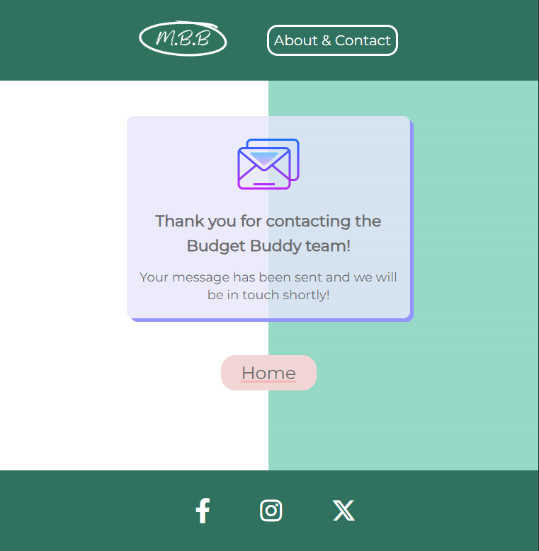

#### Favicon
- A minimal favicon has been utilized to correspond with the website layout.
- This provides ease of use to the user to find the website among any other tabs they may have open.

    
### Future Features to Implement
- A 404 page to give the user feedback if they have navigated to a page that does not exist.
- A "Reset" button on the results modal to allow the user to start again.

## Testing

### Index Page
| Test | Action | Expectation | Result |
| :---: | :---: | :---: | :---: |
| index.html header logo | Click on logo | User is taken to the home page (index.html) | Pass |
| index.html header About & Contact button | Click on About & Contact button | User is taken to the About & Contact page (about-and-contact.html) | Pass |
| index.html footer social media icons | Click on social media icons | User is taken to the social media page that opens in a new tab | Pass |
| index.html "Let's Go" button | Click on "Let's Go" button | User is taken to the income and budget modal | Pass |
| index.html pay period dropdown | Click on pay period dropdown | User is able to select a pay period that updates the titles throughout all modals | Pass |
| index.html currency dropdown | Click on currency dropdown | User is able to select a currency that updates the currency displayed throughout all modals | Pass |
| index.html income and budget modal | Click on "Next" button | Check to confirm each income input is a valid number equal to or greater than 0  | Pass |
| index.html income and budget modal | Click on "Next" button | Alert is displayed when the income input is less than 0 or not a number | Pass |
| index.html income and budget modal | Click on "Next" button | Check to confirm each budget input is a valid number equal to or greater than 0  | Pass |
| index.html income and budget modal | Click on "Next" button | Alert is displayed when the budget input is less than 0 or not a number | Pass |
| index.html income and budget modal | Click on "Next" button | Check to confirm the budget is less than or equal to the income  | Pass |
| index.html income and budget modal | Click on "Next" button | Alert is displayed when the budget is greater than the income | Pass |
| index.html income and budget modal | Click on "Next" button | User is taken to the spends modal | Pass |
| index.html income and budget modal | Click on "Back" button | User is taken to the home page (index.html) | Pass |
| index.html spends modal | Click on "Next" button | Check to confirm each spends input is a valid number equal to or greater than 0  | Pass |
| index.html spends modal | Click on "Next" button | Alert is displayed when the spends input is less than 0 or not a number | Pass |
| index.html spends modal | Click on "Back" button | User is taken to the income and budget modal and user input is retained | Pass |
| index.html spends modal | Click on "Next" button | User is taken to the results modal | Pass |
| index.html results modal | Check to confirm the total income is equal to the user's input | User's input is displayed correctly as the income total | Pass |
| index.html results modal | Check to confirm the total budget is equal to the user's input | User's input is displayed correctly as the budget total | Pass |
| index.html results modal | Check to confirm the total expenses is equal to the user's input | User's input is displayed correctly as the spends total | Pass |
| index.html results modal | Check to confirm the total savings is equal to the user's income input minus the user's spends input | User's input is displayed correctly as the savings total | Pass |
| index.html results modal | Check to confirm the rent / mortgage category is equal to the user's budget input minus the user's spends input | Result is displayed correctly along with the correct color and 'over budget', 'under budget' or 'on track' text | Pass |
| index.html results modal | Check to confirm the transport category is equal to the user's budget input minus the user's spends input | Result is displayed correctly along with the correct color and 'over budget', 'under budget' or 'on track' text | Pass |
| index.html results modal | Check to confirm the food category is equal to the user's budget input minus the user's spends input | Result is displayed correctly along with the correct color and 'over budget', 'under budget' or 'on track' text | Pass |
| index.html results modal | Check to confirm the utilities category is equal to the user's budget input minus the user's spends input | Result is displayed correctly along with the correct color and 'over budget', 'under budget' or 'on track' text | Pass |
| index.html results modal | Check to confirm the repayments category is equal to the user's budget input minus the user's spends input | Result is displayed correctly along with the correct color and 'over budget', 'under budget' or 'on track' text | Pass |
| index.html results modal | Check to confirm the other category is equal to the user's budget input minus the user's spends input | Result is displayed correctly along with the correct color and 'over budget', 'under budget' or 'on track' text | Pass |
| index.html results modal | Check to confirm the graph displays the correct percentage of the user's spends in relation to their income | Graph is displayed correctly | Pass |
| index.html results modal | Check to confirm all results update when the user changes their income, budget or spends on the previous modals | Results are displayed correctly | Pass |
| index.html results modal | Click on "Home" button | User is taken to the home page (index.html) | Pass |
| index.html results modal | Click on "Home" button | Check to confirm the user's input is cleared | User's input is cleared | Pass |
| index.html responsive design 320px | Check to confirm the layout is responsive and all content is clearly displayed | Layout is responsive and all content is clearly displayed | Pass |
| index.html responsive design 425px | Check to confirm the layout is responsive and all content is clearly displayed | Layout is responsive and all content is clearly displayed | Pass |
| index.html responsive design 768px | Check to confirm the layout is responsive and all content is clearly displayed | Layout is responsive and all content is clearly displayed | Pass |
| index.html responsive design 1024px | Check to confirm the layout is responsive and all content is clearly displayed | Layout is responsive and all content is clearly displayed | Pass |
| index.html responsive design 1440px | Check to confirm the layout is responsive and all content is clearly displayed | Layout is responsive and all content is clearly displayed | Pass |
| index.html modals responsive design 320px | Check to confirm the layout is responsive and all content is clearly displayed | Layout is responsive and all content is clearly displayed | Pass |
| index.html modals responsive design 425px | Check to confirm the layout is responsive and all content is clearly displayed | Layout is responsive and all content is clearly displayed | Pass |
| index.html modals responsive design 768px | Check to confirm the layout is responsive and all content is clearly displayed | Layout is responsive and all content is clearly displayed | Pass |
| index.html modals responsive design 1024px | Check to confirm the layout is responsive and all content is clearly displayed | Layout is responsive and all content is clearly displayed | Pass |
| index.html modals responsive design 1440px | Check to confirm the layout is responsive and all content is clearly displayed | Layout is responsive and all content is clearly displayed | Pass |

### About & Contact Page
| Test | Action | Expectation | Result |
| :---: | :---: | :---: | :---: |
| about-and-contact.html header logo | Click on logo | User is taken back to the home page (index.html) | Pass |
| about-and-contact.html header About & Contact button | Click on About & Contact button | User is taken to the About & Contact page (about-and-contact.html) | Pass |
| about-and-contact.html footer social media icons | Click on social media icons | User is taken to the social media page that opens in a new tab | Pass |
| about-and-contact.html contact form inputs | Click on contact form inputs | User is able to input their name, email, contact number and query | Pass |
| about-and-contact.html contact form inputs | Correct input types are set for each input field | User is prompted to enter the correct input type if incorrect | Pass |
| about-and-contact.html contact form submit button | Click on submit button | User is prompted to fill in the required fields if not filled in | Pass |
| about-and-contact.html contact form submit button | Click on submit button | User is taken to the thank you page (thank-you.html) | Pass |
| about-and-contact.html responsive design 320px | Check to confirm the layout is responsive and all content is clearly displayed | Layout is responsive and all content is clearly displayed | Pass |
| about-and-contact.html responsive design 425px | Check to confirm the layout is responsive and all content is clearly displayed | Layout is responsive and all content is clearly displayed | Pass |
| about-and-contact.html responsive design 768px | Check to confirm the layout is responsive and all content is clearly displayed | Layout is responsive and all content is clearly displayed | Pass |
| about-and-contact.html responsive design 1024px | Check to confirm the layout is responsive and all content is clearly displayed | Layout is responsive and all content is clearly displayed | Pass |
| about-and-contact.html responsive design 1440px | Check to confirm the layout is responsive and all content is clearly displayed | Layout is responsive and all content is clearly displayed | Pass |

### Thank You Page
| Test | Action | Expectation | Result |
| :---: | :---: | :---: | :---: |
| thank-you.html header logo | Click on logo | User is taken back to the home page (index.html) | Pass |
| thank-you.html header About & Contact button | Click on About & Contact button | User is taken to the About & Contact page (about-and-contact.html) | Pass |
| thank-you.html footer social media icons | Click on social media icons | User is taken to the social media page that opens in a new tab | Pass |
| thank-you.html home button | Click on home button | User is taken back to the home page (index.html) | Pass |
| thank-you.html responsive design 320px | Check to confirm the layout is responsive and all content is clearly displayed | Layout is responsive and all content is clearly displayed | Pass |
| thank-you.html responsive design 425px | Check to confirm the layout is responsive and all content is clearly displayed | Layout is responsive and all content is clearly displayed | Pass |
| thank-you.html responsive design 768px | Check to confirm the layout is responsive and all content is clearly displayed | Layout is responsive and all content is clearly displayed | Pass |
| thank-you.html responsive design 1024px | Check to confirm the layout is responsive and all content is clearly displayed | Layout is responsive and all content is clearly displayed | Pass |
| thank-you.html responsive design 1440px | Check to confirm the layout is responsive and all content is clearly displayed | Layout is responsive and all content is clearly displayed | Pass |

### Lighthouse
| Test | Action | Expectation | Result |
| :---: | :---: | :---: | :---: |
| index.html desktop | Run Lighthouse | Lighthouse score of 90 or above for Performance, Accessibility, Best Practices and SEO | Pass |
| index.html mobile | Run Lighthouse | Lighthouse score of 90 or above for Performance, Accessibility, Best Practices and SEO | Pass |
| about-and-contact.html desktop | Run Lighthouse | Lighthouse score of 90 or above for Performance, Accessibility, Best Practices and SEO | Pass |
| about-and-contact.html mobile | Run Lighthouse | Lighthouse score of 90 or above for Performance, Accessibility, Best Practices and SEO | Pass |
| thank-you.html desktop | Run Lighthouse | Lighthouse score of 90 or above for Performance, Accessibility, Best Practices and SEO | Pass |
| thank-you.html mobile | Run Lighthouse | Lighthouse score of 90 or above for Performance, Accessibility, Best Practices and SEO | Pass |

### Validator Testing
- HTML
    - No errors were returned for index.html when passing through the official [W3C validator](https://validator.w3.org/nu/?doc=https%3A%2F%2Ftaalverena.github.io%2Fmy-budget-buddy%2F)
    - No errors were returned for about-and-contact.html when passing through the official [W3C validator](https://validator.w3.org/nu/?doc=https%3A%2F%2Ftaalverena.github.io%2Fmy-budget-buddy%2Fabout-and-contact.html)
    - No errors were returned for thank-you.html when passing through the official [W3C validator](https://validator.w3.org/nu/?doc=https%3A%2F%2Ftaalverena.github.io%2Fmy-budget-buddy%2Fthank-you.html)
- CSS
    - No errors were returned for style.css when passing through the official [(Jigsaw) validator](https://jigsaw.w3.org/css-validator/validator?uri=https%3A%2F%2Ftaalverena.github.io%2Fmy-budget-buddy%2Fassets%2Fcss%2Fstyle.css&profile=css3svg&usermedium=all&warning=1&vextwarning=&lang=en)
- JavaScript
    - No errors were returned for script.js when passing through the official [JSHint validator](https://jshint.com/)

### WAVE
- index.html
    - No errors were returned for index.html when passing through the [WAVE Web Accessibility Evaluation Tool](https://wave.webaim.org/report#/https://taalverena.github.io/my-budget-buddy/)
- about-and-contact.html
    - No errors were returned for about-and-contact.html when passing through the [WAVE Web Accessibility Evaluation Tool](https://wave.webaim.org/report#/https://taalverena.github.io/my-budget-buddy/about-and-contact.html)
- thank-you.html
    - No errors were returned for thank-you.html when passing through the [WAVE Web Accessibility Evaluation Tool](https://wave.webaim.org/report#/https://taalverena.github.io/my-budget-buddy/thank-you.html)

### Bugs

#### Fixed Bugs
- The income total was not adding up correctly when going back and changing the income or budget inputs. This was fixed by adding a function that resets the results when the user clicks the "Back" button.
- The graph was not updating correctly when going back and changing the income or budget inputs. This was fixed by adding a chart.destroy() function to before the chart is created.

#### Unfixed Bugs
- There are no unfixed bugs.

## Deployment

### ***GitHub Pages***

The project was deployed to GitHub Pages using the following steps:

1. Log in to GitHub and locate the [My Budget Buddy Repository](https://github.com/TaalVerena/my-budget-buddy).
2. At the top of the Repository, locate the "Settings" Button on the menu.
3. Scroll down the Settings page until you locate the "Pages" section.
4. Under "Source", click the dropdown called "None" and select "Main Branch".
5. The page will automatically refresh.
6. Scroll back down through the page to locate the now published site [My Budget Buddy Link](https://taalverena.github.io/my-budget-buddy/) in the "Pages" section.

### ***Forking the GitHub Repository***

By forking the GitHub Repository we make a copy of the original repository on our GitHub account to view and/or make changes without affecting the original repository by using the following steps:

1. Log in to GitHub and locate the [My Budget Buddy Repository](https://github.com/TaalVerena/my-budget-buddy).
2. At the top of the Repository (not top of page) just above the "Settings" icon on the menu, locate the "Fork" Button.
3. You should now have a copy of the original repository in your GitHub account.

### ***Making a Local Clone***

1. Log in to GitHub and locate the [My Budget Buddy Repository](https://github.com/TaalVerena/my-budget-buddy).
2. Under the repository name, click the "Code" dropdown and select "Local".
3. To clone the repository using HTTPS, under "Clone HTTPS", copy the link.
4. Open Git Bash.
5. Change the current working directory to the location where you want the cloned directory to be made.
6. Type `git clone`, and then paste the URL you copied in Step 3.

```
$ git clone https://github.com/TaalVerena/my-budget-buddy.git
```

7. Press Enter. Your local clone will be created.

```
$ git clone https://github.com/TaalVerena/my-budget-buddy.git
> Cloning into `CI-Clone`...
> remote: Counting objects: 10, done.
> remote: Compressing objects: 100% (8/8), done.
> remove: Total 10 (delta 1), reused 10 (delta 1)
> Unpacking objects: 100% (10/10), done.
```

Click [Here](https://help.github.com/en/github/creating-cloning-and-archiving-repositories/cloning-a-repository#cloning-a-repository-to-github-desktop) to retrieve pictures for some of the buttons and more detailed explanations of the above process.


## Credits

### Content
- Wireframes designed using [Figma](https://www.figma.com/)

### Media

### Color Scheme, Fonts & Icons
- Social media icons sourced from [Font Awesome](https://fontawesome.com/)
- Email icon sourced from [Icons8](https://icons8.com/)

### Extensions

### Other
- [PiaNotes](https://github.com/AlexaH88/pianotes/blob/main/README.md) README deployment layout was used.
