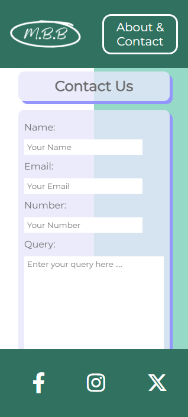

# My Budget Buddy

## Introduction
Welcome to My Budget Buddy, a website designed to make budgeting a breeze. Our website is here to make the user feel right at home with calming colors, a minimal layout and easy to follow steps.
### Live Website
The live My Budget Buddy website can be found [here](https://taalverena.github.io/my-budget-buddy/).
## Table of Contents

## User Experience

### Who My Budget Buddy Caters For

### User Stories
| User Want or Need | How It Is Achieved | Achieved |
| :---------------: | :----------------: | :------: |
| Easily see what the website is for and how to use it | An About & Contact page has been set up with information about the website and steps on how to use the website | Yes |
| Navigate the website with ease | Buttons are set up throughout the page (in the header, footer and throughout the different sections) | Yes |
| Easily input income, budget & expenses | Modals created with clearly labelled inputs for different categories | Yes |
| Quick access to my results | Results shown once the 3 sections are filled in | Yes |
| Results breakdown | Results broken down into total, per category and shown in a bar graph | Yes |
| Get in contact with the My Budget Buddy team | A contact form has been provided along with a thank you page as confirmation after the form is submitted | Yes |


## Site Overview

## Planning

### Figma Wireframes

#### Landing Page
- On Mobiles:

    

- On Larger Devices:

    
#### Income & Budget Modal
- On Mobiles:

      

     
- On Larger Devices:
  
    

#### Spends Modal
- On Mobiles:

    
- On Larger Devices:

    
#### Results Modal
- On Mobiles:

    

    
- On Larger Devices:

    
#### Contact Form
- On Mobiles:

    
- On Larger Devices:

    
#### Thank You Page
- On Mobiles:

    
- On Larger Devices:

    
#### 404 Page
- On Mobiles:

    
- On Larger Devices:

    
### Color Scheme

## Features

### Existing Features

#### Navigation Bar / Header
- On mobiles the navigation bar consists of the My Budget Buddy logo and Contact Us button. The logo takes the user to the home page and the Contact Us button takes the user to the contact form.
  
    
- On larger devices, the layout changes to shift the header information to the footer to make the main content stand out more.
    

#### Landing Page
- The landing page offers a minimalistic layout including the header, cover text title, short description, "Let's Go" button and the footer.
- The user is presented with instant feedback as to what the My Budget Buddy website is for, whilst keeping the layout minimal, giving a feel of ease.
- By clicking the "Let's Go" button, the user is presented with the first section of the My Budget Buddy modal.

    
#### Footer
- On mobiles the footer contains the social media links which open in separate tabs and include aria labels for accessibility.

    
- On larger devices the footer includes the social media links as well as the logo and Contact Us button to put the main content as the focus. The logo takes the user to the home page and the Contact Us button takes the user to the contact form.

    
#### Income & Budget Modal
- On mobiles the user is presented with the my income modal where they select their pay period and currency from dropdowns and fill in their income. By scrolling down, the user is then presented with the budget modal where they fill in their budget for different categories.

    
    
- On larger devices, the layout is changed to present the user with the income modal and budget modal next to each other.

    
- After the user has selected the pay period, the selection will appear in the heading as confirmation.
- After the user has selected the currency, the currency will appear next to the input fields as confirmation.
- When the "Next" button is clicked, a calculation is done to check if the budget is less than or equal to the income. If it is, the user is taken to the next modal. If the budget is more than the income, the user is presented with an alert to re-visit their budget.

#### Spends Modal
- The spends modal has the same information as the budget modal and once the "Next" button is clicked, the user is taken to the results modal.

    
    
    
#### Results Modal
- On mobiles the user is first provided with a breakdown of their results per category. After scrolling, the user is also provided with a pie chart as an overall result.
- On larger devices, the user is provided with the breakdown as well as the pie chart next to each other.
- The individual categories take the budget and spends values to calculate if the user is over budget, under budget or on track:
  - Over budget values are presented in red.
  - Under budget values are presented in green.
  - On track values are presented in lavendar.
- A "Home" button is provided at the end of the modal as confirmation to the user that the budget is complete.

    
    
    
    
    
#### About & Contact Page
- The About & Contact Page consists of an About Us section, How It Works section and Contact Us form.
- The layout is the same on mobiles and desktops with margin and padding adjusted depending on the device size.
##### About Us
- This section gives the user information about what My Budget Buddy is for and confirms that it manages income, expense and budget goals.

    

    
##### How It Works
- This section explains how the website works, how to navigate each modal and what My Budget Buddy can do for them.

    

    
##### Contact Us
- This section enables to user to contact the My Budget Buddy team through the use of a quick, minimal contact form.
- The user fills in their name, email, contact number and query. Each input field checks to confirm that the correct type of information has been inputted.
- A "Submit" button is visible at the bottom of the contact form and when clicked, the user is taken to the "Thank you Page".

    
    

#### Thank You Page
- The "Thank You Page" maintains the same minimal layout as the rest of the website.
- This provides the user with confirmation that their query has been submitted and one of the team will be in touch.
- A "Home" button is visible after the message which takes the user to the home page.
    
    
#### 404 Page
- A 404 page has been designed should a part of the website not load.
- This lets the user know that something has not gone to plan and directs them to the home page with an arrow.

#### Favicon
- A minimal favicon has been utilized to correspond with the website layout.
- This provides ease of use to the user to find the website among any other tabs they may have open.

    
### Future Features to Implement

## Testing

| Test | Action | Expectation | Result |
| :---: | :---: | :---: | :---: |
| Test | Action | Expectation | Result |
| Test | Action | Expectation | Result |

### Lighthouse

### Validator Testing
- HTML
- CSS
- JavaScript

### WAVE

### Bugs

#### Fixed Bugs

#### Unfixed Bugs

## Deployment

### ***GitHub Pages***

The project was deployed to GitHub Pages using the following steps:

1. Log in to GitHub and locate the [My Budget Buddy Repository](https://github.com/TaalVerena/my-budget-buddy).
2. At the top of the Repository, locate the "Settings" Button on the menu.
3. Scroll down the Settings page until you locate the "Pages" section.
4. Under "Source", click the dropdown called "None" and select "Main Branch".
5. The page will automatically refresh.
6. Scroll back down through the page to locate the now published site [My Budget Buddy Link](https://taalverena.github.io/my-budget-buddy/) in the "Pages" section.

### ***Forking the GitHub Repository***

By forking the GitHub Repository we make a copy of the original repository on our GitHub account to view and/or make changes without affecting the original repository by using the following steps:

1. Log in to GitHub and locate the [My Budget Buddy Repository](https://github.com/TaalVerena/my-budget-buddy).
2. At the top of the Repository (not top of page) just above the "Settings" icon on the menu, locate the "Fork" Button.
3. You should now have a copy of the original repository in your GitHub account.

### ***Making a Local Clone***

1. Log in to GitHub and locate the [My Budget Buddy Repository](https://github.com/TaalVerena/my-budget-buddy).
2. Under the repository name, click the "Code" dropdown and select "Local".
3. To clone the repository using HTTPS, under "Clone HTTPS", copy the link.
4. Open Git Bash.
5. Change the current working directory to the location where you want the cloned directory to be made.
6. Type `git clone`, and then paste the URL you copied in Step 3.

```
$ git clone https://github.com/TaalVerena/my-budget-buddy.git
```

7. Press Enter. Your local clone will be created.

```
$ git clone https://github.com/TaalVerena/my-budget-buddy.git
> Cloning into `CI-Clone`...
> remote: Counting objects: 10, done.
> remote: Compressing objects: 100% (8/8), done.
> remove: Total 10 (delta 1), reused 10 (delta 1)
> Unpacking objects: 100% (10/10), done.
```

Click [Here](https://help.github.com/en/github/creating-cloning-and-archiving-repositories/cloning-a-repository#cloning-a-repository-to-github-desktop) to retrieve pictures for some of the buttons and more detailed explanations of the above process.


## Credits

### Content
- Wireframes designed using [Figma](https://www.figma.com/)

### Media

### Color Scheme, Fonts & Icons
- Social media icons sourced from [Font Awesome](https://fontawesome.com/)
- Email icon sourced from [Icons8](https://icons8.com/)

### Extensions

### Other
- [PiaNotes](https://github.com/AlexaH88/pianotes/blob/main/README.md) README deployment layout was used.
